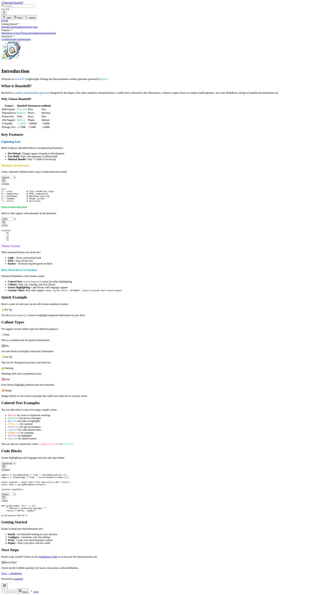
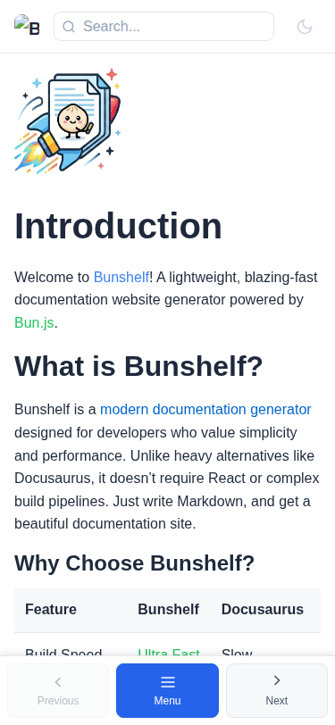

# Bunshelf

A modern, fast, and beautiful documentation generator with built-in themes, search, and i18n support. Built with Bun.






## Features

- 🚀 **Fast** - Built with Bun for incredible performance
- 🎨 **Beautiful Themes** - Light, Dark, and Hacker themes built-in
- 🔍 **Full-text Search** - Powered by Fuse.js
- 🌍 **i18n Ready** - Multi-language support out of the box
- 📱 **Responsive** - Mobile-first design with bottom action bar
- 🎯 **Zero Config** - Works out of the box, customize when needed
- ⚡ **Static Site** - No server required, deploy anywhere

## Quick Start

### Installation

```bash
# Using npm
npm install -D bunshelf

# Using bun
bun add -d bunshelf

# Using yarn
yarn add -D bunshelf
```

### Project Structure

Create a `docs` folder in your project:

```
your-project/
├── docs/
│   ├── en/
│   │   ├── intro.md
│   │   ├── getting-started/
│   │   │   ├── installation.md
│   │   │   └── quick-start.md
│   │   └── config.yaml
│   └── tr/
│       └── intro.md
└── package.json
```

### Add Scripts

Add these scripts to your `package.json`:

```json
{
  "scripts": {
    "docs:dev": "bunshelf dev",
    "docs:build": "bunshelf build",
    "docs:preview": "bunshelf preview"
  }
}
```

### Run Development Server

```bash
npm run docs:dev
```

Visit `http://localhost:3000` to see your documentation.

### Build for Production

```bash
npm run docs:build
```

Output will be in the `dist/` folder.

## Configuration

Create a `config.yaml` in your `docs/` folder:

```yaml
title: My Documentation
description: A comprehensive guide
defaultLocale: en
locales:
  - en
  - tr
  - de

theme:
  default: light

sidebar:
  en:
    - label: Getting Started
      collapsed: false
      items:
        - label: Introduction
          href: /intro
        - label: Installation
          href: /getting-started/installation
    - label: Advanced
      items:
        - label: Configuration
          href: /advanced/configuration
```

## Markdown Features

### Frontmatter

```markdown
---
title: Page Title
description: A brief description
order: 1
sidebar_label: Custom Label
hide: false
---

# Page Content
```

### Colored Text

```html
<span style="color: #ef4444" class="colored-text">Red text</span>
<span style="color: #22c55e" class="colored-text">Green text</span>
<span style="color: #3b82f6" class="colored-text">Blue text</span>
```

### Callouts

```html
<div class="callout callout-note">
  <div class="callout-title">
    <span class="callout-icon">📝</span>
    <span>Note</span>
  </div>
  <div class="callout-content">
    <p>Important information here.</p>
  </div>
</div>
```

Types: `callout-note`, `callout-tip`, `callout-warning`, `callout-error`

### Code Blocks with Language Selector

````markdown
```bash
npm install bunshelf
```
````

## CLI Commands

```bash
bunshelf dev       # Start development server
bunshelf build     # Build static site
bunshelf preview   # Preview production build
bunshelf --help    # Show help
bunshelf --version # Show version
```

## Programmatic API

```typescript
import { 
  parseDocument, 
  renderPage, 
  buildSearchIndex,
  loadConfig 
} from 'bunshelf';

// Parse markdown
const { meta, html } = parseDocument(markdownContent);

// Build search index
const searchIndex = await buildSearchIndex(docsDir, ['en', 'tr']);

// Load config
const config = await loadConfig(docsDir);

// Render page
const pageHtml = renderPage({
  locale: 'en',
  title: 'My Page',
  description: 'Description',
  content: html,
  sidebar: sidebarItems,
  currentSlug: 'intro',
  config,
  searchIndex,
  themes: []
});
```

## Themes

### Built-in Themes

- **Light** - Clean and bright
- **Dark** - Easy on the eyes
- **Hacker** - Matrix-inspired green on black

### Custom Theme

```typescript
import { themes } from 'bunshelf';

const customTheme = {
  name: 'my-theme',
  label: 'My Theme',
  vars: {
    '--bg-primary': '#ffffff',
    '--text-primary': '#000000',
    '--accent-primary': '#3b82f6',
    // ... more variables
  }
};

themes.push(customTheme);
```

## Deployment

### Vercel

```bash
vercel deploy dist
```

### Netlify

```bash
netlify deploy --prod --dir=dist
```

### GitHub Pages

Push the `dist/` folder to your `gh-pages` branch.

## Mobile Responsive

Bunshelf is built mobile-first with:

- **Bottom Action Bar** - Easy navigation on mobile (Previous/Next + Menu)
- **Responsive Search** - Optimized input sizes
- **Collapsible Sidebar** - Swipe-friendly on mobile
- **No Zoom Issues** - Proper viewport and font-size settings

## Requirements

- **Bun** >= 1.0.0 (recommended)

> **Note:** Bunshelf is primarily designed for Bun runtime. While a Node.js compatibility layer exists, some features may have limited functionality. For the best experience, use Bun.

## License

MIT

## Contributing

Contributions are welcome! Please read our contributing guidelines.

## Support

- 📖 [Documentation](https://github.com/speretta/bunshelf)
- 🐛 [Issue Tracker](https://github.com/speretta/bunshelf/issues)
- 💬 [Discussions](https://github.com/speretta/bunshelf/discussions)
